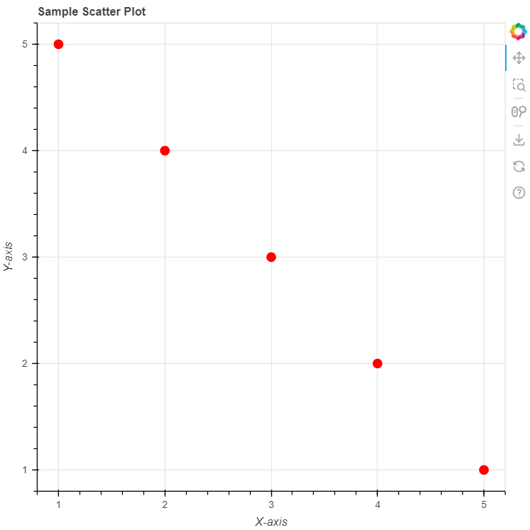
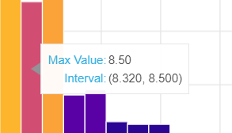

# Exploration Activity 1: Library/Package Overview


## 1. Which package/library did you select?

The library selected for the first exploration activity is the python **Bokeh** library.


## 2. What is the package/library?

Bokeh is an interactive visualization library for modern web browsers. It provides elegant, concise construction of versatile graphics and affords high-performance interactivity across large or streaming datasets.[ref](https://github.com/bokeh/bokeh)

### What purpose does it serve?

Bokeh assists in creating simple to complext data visualizations, thus, allowing anyone to create interactive plots, dashboards and data applications quickly and easily. The main advantages of using Bokeh are:[ref](https://bokeh.org/)
1. *Flexibility*: Bokeh makes the process of building not only common plots but also custom/specialized use cases simple.
2. *Interactive*: Tools and widgets can be used to allow the viewer to interact with the visual and dive deeper into the data presented.
3. *Shareability*: Bokeh visualizations can be published in web pages or Jupyter notebooks.
4. *Productivity*: Enables one to work within Python along with their other tools so they do not have to search outside.
5. *Powerful*: Bokeh offers custom JavaScript support for advanced use cases.
6. *Open Source*: Everything is accessible on GitHub.

### How do you use it?

In order to use Bokeh, one simply needs to install the library using `pip install Bokeh` command in the terminal. In this manner, one can import all the required Bokeh modules while programming. 

**To begin creating a visualization:**[ref](https://realpython.com/python-data-visualization-bokeh/)
1. *Specify your data*: This can either be done manually using arrays or data can be imported from .csv files using the Panda library.
2. *Prepare your data*: Use DataFrames to organize your data or select and store specific columns from your dataFrame that you would like to use in you visualization.
3. *Create a Bokeh figure*: Set up a basic outline for your Bokeh figure by specifying plot height, width, title, axes, etc.
4. *Create your plot*: Use glyphs to represent your data such as circles, lines, square and bars.
5. *Customize your plot*: Add labels, legends, color mappers, etc. to format the plot to your liking and make it visually appealing.
6. *Decide Render Method*: Determine how you will be viewing your visualization, whether you would like to generate an HTML file or `show()` inline in a Jupyter notebook.


## 3. What are the functionalities of the package/library?
Bokeh has a wide range of functionalities and applications such as:[ref](https://bokeh.org/)
1. Bokeh supports a large array of plots such as scatter plots, line charts, pie charts, histograms, area plots and many more.
Here is a simple program for creating a scatter plot:
```
from bokeh.plotting import figure, show

p = figure(title="Sample Scatter Plot", x_axis_label="X-axis", y_axis_label="Y-axis")

x = [1, 2, 3, 4, 5]
y = [5, 4, 3, 2, 1]
p.circle(x, y, size=10, color="red")

show(p)
```
Output:


2. Bokeh is a bridge that connects Python's analytic tools such as NumPy, Scipy, Pandas, Dask, etc. to rich, interactive visualizations in the browser.
Here is a snippet from the bokehEA1.ipynb program which utilizes a hovertools to interact with the bars of the histogram:
```
hover = HoverTool()
hover.tooltips = [("Max Value", "@max_value{0.00}"), ("Interval", "(@left, @right)")]
p.add_tools(hover)
```
Output:


3. Bokeh offers its own basic grid and row/column layouts. It’s also possible to embed Bokeh plots and widgets into popular templates When you need slick, reponsive dashboards. Thus, Bokeh's powerful APIs are appreciated by data scientists and developers.
4. Bokeh enhances data exploration as it works in both JupyterLab and classic notebooks.
5. Bokeh has efficient streaming APIs to help you keep on top of things. In a Bokeh server application, it is as simple as passing your new data values to a stream method:
`source.stream({'x': new_xs, 'y': new_ys})`
But standalone Bokeh output can handle streaming data too, using either the `AjaxDataSource` or the `ServerSentDataSource`.
6. Bokeh offers a variety of methods to embed its content in web pages: `server_document` for deployed Bokeh server applications, or `json_items` and `components` for standalone Bokeh output.

## 4. When was it created?
Bokeh was created in 2013.[ref](https://medium.com/codex/bokeh-an-interactive-data-visualization-library-6dfbfb1c596c#:~:text=Bokeh%20is%20a%20Python%20library,has%20been%20around%20since%202013.)


## 5. Why did you select this package/library?
I am interested in visual design and graphics, therefore, the concept of a library dedicated to creating dynamic visuals is very appealing to me. Moreover, I have worked on data quality, large datasets and critical business use cases during my past co-op term and my current role at Irving Oil. One main question for everyone was how the data can be presented to the business through easy to read visualizations and dashboards. Due to these reasons, I wanted to explore Bokeh and experience how easy or difficult it would be to use it.


## 6. How did learning the package/library influence your learning of the language?
Learning Bokeh has influenced me by familiarizing me with data management and data visualization concepts through coding. I have been introduced to Python's extensive capabilities as well as a new method to reading data via csv files which I find will be very useful and versatile for many problems. Overall, learning Bokeh has pushed me to become more comfortable with Python and its tools.


## 7. How was your overall experience with the package/library?
My overall experience with Bokeh has been interesting. As a beginner, getting used to the vast terminologies and functions contained in the library was confusing and it was extremely time consuming to format a code that will provide me with my desired visual. However, once I was familiarized, it was easy to take code snippets and alter them to my liking and my data which I feel is advantageous as it is similar to a template.

### When would you recommend this package/library to someone?
I would recomment this library to someone who is looking to dive deeper and explore their datasets. Also, this library will be extremely helpful in presenting data to customers, or non technical business members as the visualizations are easy to understand and shareable through web pages and dashboards.

### Would you continue using this package/library? Why or why not?
I would continue using this library due to my initial reason for choosing Bokeh. I would like to keep on exploring the dashboard functionality and perhaps data streaming to see how it can be implemented for business use cases.