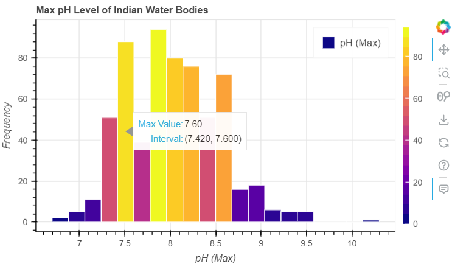

# Bokeh Histogram Program

## 1. Which package/library does the sample program demonstrate?

This sample program demonstrates the use of the following Python libraries and packages:
- Bokeh: Bokeh is an interactive visualization library for modern web browsers.[ref](https://github.com/bokeh/bokeh)
- Pandas: A data manipulation and analysis library used for reading and manipulating CSV data.
The main focus of the program is to demonstrate the visualization capability of the Bokeh library. The Panda library is mainly used for the purpose of inputting real world data for the graph.

## 2. How does someone run your program?

To run the program, follow these steps:

1. Make sure that Python3 is installed on your system.
2. Install the Bokeh and Panda libraries by running the following command in your terminal or command prompt:
   `pip install bokeh pandas`
3. Download and open **bokehEA1.ipynb** using Jupyter or via VSCode (with Jupyter extension installed).
4. Download **Water_pond_tanks_2021.csv**[ref](https://www.kaggle.com/datasets/balabaskar/water-quality-data-india/) and change `csv_file` variable value in the code to the path where you downloaded the csv file.
5. Run bokehEA1.ipynb through the IDE.
6. You should find an output html file generated with a visualization in your current directory or a webpage may pop-up with the visualization.

## 3. What purpose does your program serve?

The program utilizes real word data and presents it as a visually pleasing, easy to understand and interactive histogram visualization. The program specifically graphs the trend in the maximum pH value of water bodies in India and also allows the user to hover over the bars of the histogram to view more detailed information.

## 4. What would be some sample input/output?

### Sample Input:
```
pH (Max)
8.0
7.8
8.2
7.9
8.0
... 
8.5
7.6
7.6
7.6
7.9
```

### Sample Output:


